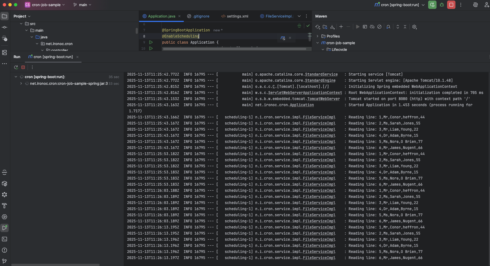

# cron-job-sample

[](https://github.com/conorheffron/cron-job-sample/actions/workflows/maven.yml)


## Overview
- This project is an example of how to set up a job to read a local CSV file with Spring annotations and some basic configurations. It provides a basic template for Java/Spring developers.

## Technologies
- JDK 17, Spring Boot 3, & Maven

## Build Project
```shell
./mvnw clean package
```

## Run Project
```shell
./mvnw spring-boot:run
```

## Track Logs (File Service Job Runs every 10 seconds, reading file line by line `src/main/resources/feed_file.csv`)
